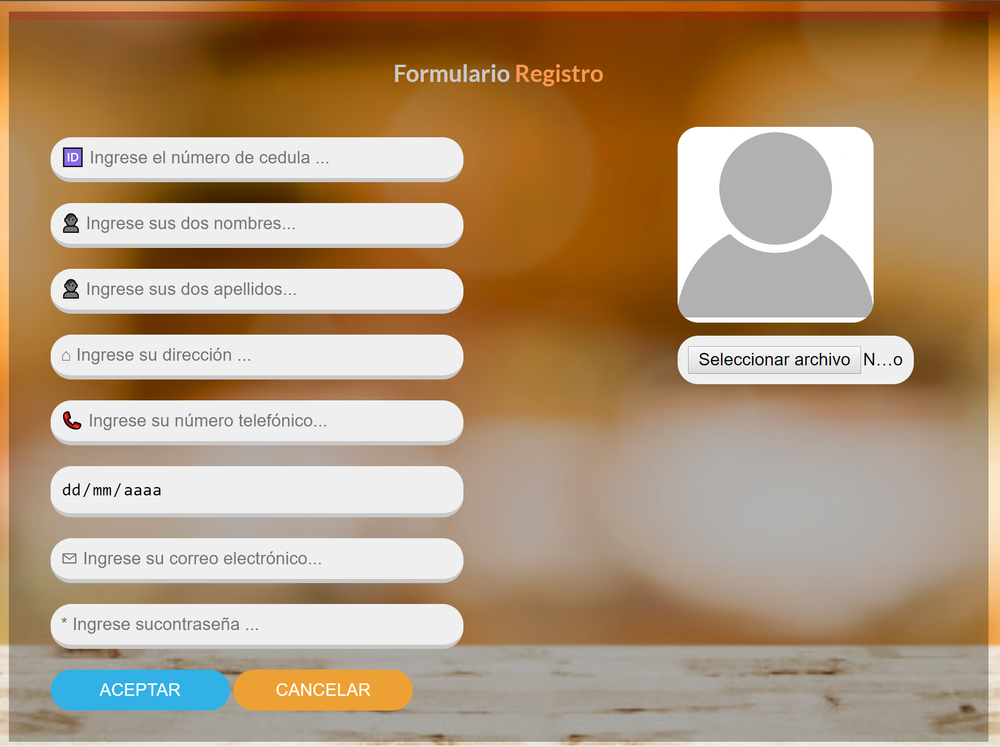
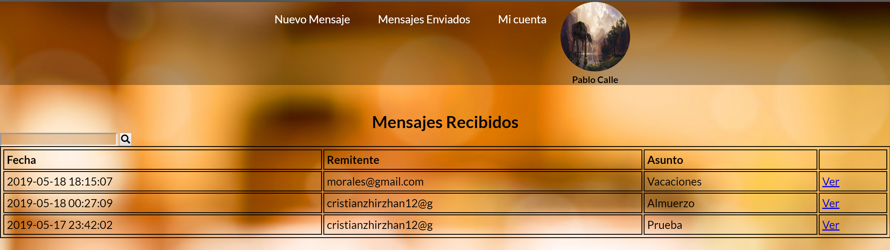
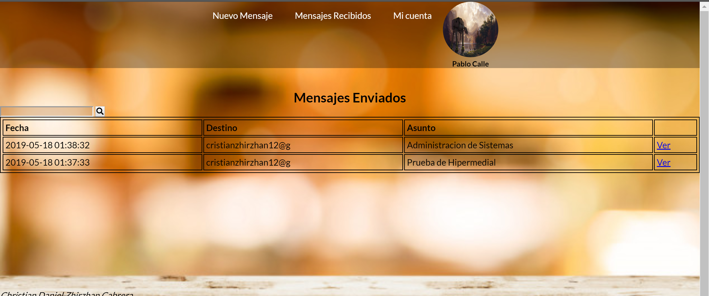
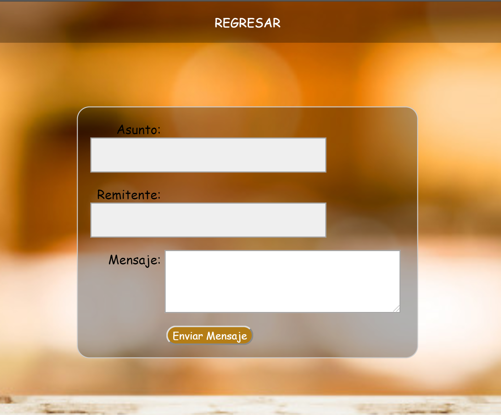
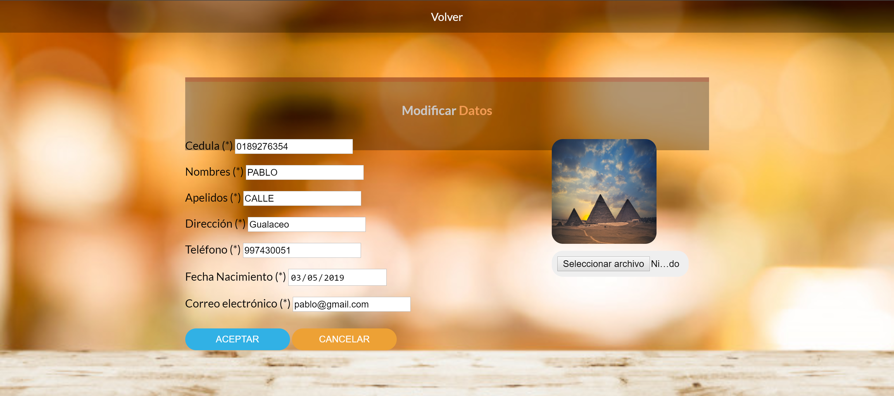
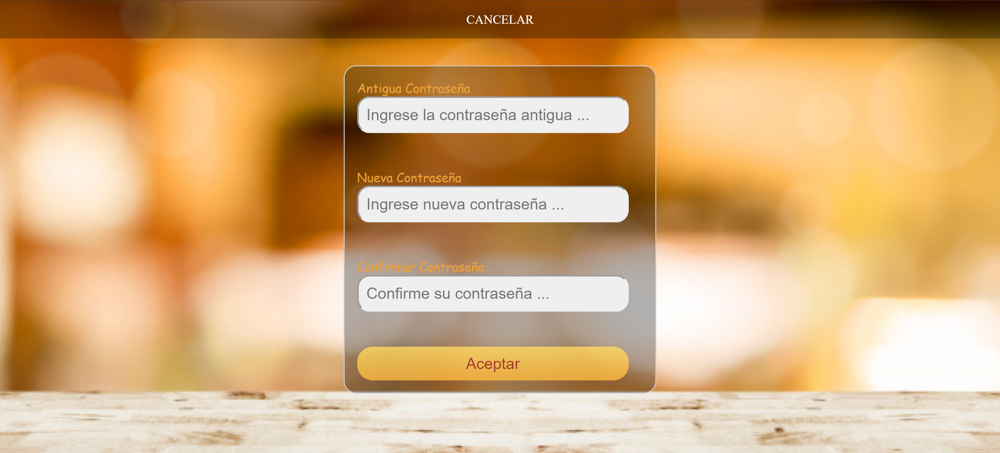
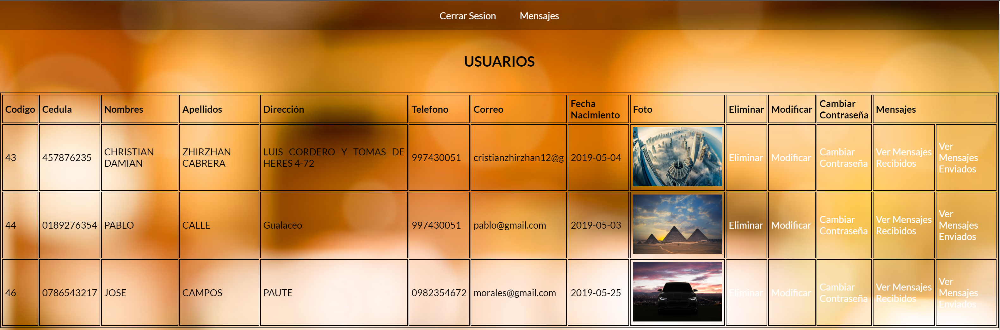
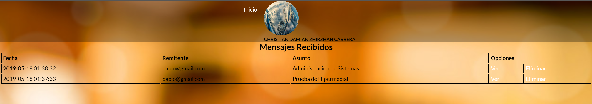
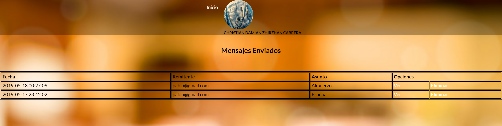
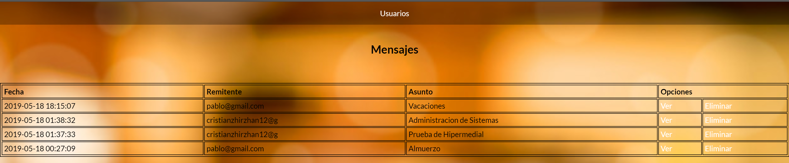

**PRACTICA DE CORREO ELECTRONICO**

**Desarrollo de los puntos:**

-   **Usuario con el rol de user.**

    *Creación del Usuario.*

    Codigo HTML.

    \<!DOCTYPE html\>

    \<html lang="es"\>

    \<head\>

    \<meta charset="UTF-8"\>

    \<link rel="stylesheet" href="../../config/styles/reset.css"\>

    \<link rel="stylesheet" href="../../config/styles/stylesCrUser.css"\>

    \<link rel="stylesheet" href="../../config/styles/menuH.css"\>

    \<title\>Formulario\</title\>

    \</head\>

    \<body\>

    \

    \<header\>

    \<input type="checkbox" id="btn_menu"\>

    \<label for="btn_menu"\>\\</label\>

    \

    \<ul\>

    \<li\>\<a href="../../public/vista/login.html"\>Iniciar Sesion\</a\>\</li\>

    \</ul\>

    \</div\>

    \</header\>

    \

    \

    \<h2\>Formulario \<span\>Registro\</span\>\</h2\>

    \</div\>

    \<form class="form__reg " method="POST"
    action="../controladores/crear_usuario.php"

    enctype="multipart/form-data"\>

    \

    \<input class="input" type="text" id="cedula" name="cedula" value=""

    maxlength="10" placeholder="\&\#127380; Ingrese el número de cedula ..."

    required /\>

    \<input class="input" type="text" id="nombres" name="nombres" value=""

    placeholder="\&\#128100; Ingrese sus dos nombres..." required /\>

    \<input class="input" type="text" id="apellidos" name="apellidos" value=""

    placeholder="\&\#128100; Ingrese sus dos apellidos..." required /\>

    \<input class="input" type="text" id="direccion" name="direccion" value=""

    placeholder="\&\#8962; Ingrese su dirección ..." required /\>

    \<input class="input" type="text" id="telefono" name="telefono" value=""

    placeholder="\&\#128222; Ingrese su número telefónico..." required /\>

    \<input class="input" type="date" id="fechaNacimiento"
    name="fechaNacimiento"

    value="" placeholder="Ingrese su fecha de nacimiento ..." required /\>

    \<input class="input" type="email" id="correo" name="correo" value=""

    placeholder="\&\#9993; Ingrese su correo electrónico..." required /\>

    \<input class="input" type="password" id="contrasena" name="contrasena"
    value=""

    placeholder="\&\#42; Ingrese sucontraseña ..." required /\>

    \

    \<input class="crear" type="submit" id="crear" name="crear"

    value="ACEPTAR" /\>

    \<input class="cancelar" type="reset" id="cancelar" name="cancelar"

    value="CANCELAR" /\>

    \</div\>

    \</div\>

    \

    \

    \

    \<br\>

    \<input class="actualizar" type="file" id="foto" name="foto"

    value="../../config/images/perfil.jpg" /\>

    \</div\>

    \</div\>

    \</form\>

    \</div\>

    \

    \<footer\>

    \<address\>

    Christian Daniel Zhirzhan Cabrera\<br\>

    Universidad Politecnica Salesiana\<br\>

    \<a href="mailto:czhirzhanc\@est.ups.edu.ec"\>Email\</a\>\<br\>

    \<a href="tel:2520890 "\>Clicka para llamar\</a\>

    \</address\>

    \<br\>

    \<p\>\&copy; Todos los derechos reservados\</p\>

    \</footer\>

    \</div\>

    \</div\>

    \</body\>

    \</html\>

    Codigo PHP (Controlador)

    \<!DOCTYPE html\>

    \<html\>

    \<head\>

    \<meta charset="UTF-8"\>

    \<title\>Crear Nuevo Usuario\</title\>

    \<style type="text/css" rel="stylesheet"\>

    .error {

    color: red;

    }

    \</style\>

    \</head\>

    \<body\>

    \<?php

    //incluir conexión a la base de datos

    include '../../config/conexionBD.php';

    \$cedula = isset(\$_POST["cedula"]) ? trim(\$_POST["cedula"]) : null;

    \$nombres = isset(\$_POST["nombres"]) ?
    mb_strtoupper(trim(\$_POST["nombres"]), 'UTF-8') : null;

    \$apellidos = isset(\$_POST["apellidos"]) ?
    mb_strtoupper(trim(\$_POST["apellidos"]), 'UTF-8') : null;

    \$direccion = isset(\$_POST["direccion"]) ?
    mb_strtoupper(trim(\$_POST["direccion"]), 'UTF-8') : null;

    \$telefono = isset(\$_POST["telefono"]) ? trim(\$_POST["telefono"]): null;

    \$correo = isset(\$_POST["correo"]) ? trim(\$_POST["correo"]): null;

    \$fechaNacimiento = isset(\$_POST["fechaNacimiento"]) ?
    trim(\$_POST["fechaNacimiento"]): null;

    \$contrasena = isset(\$_POST["contrasena"]) ? trim(\$_POST["contrasena"]) :
    null;

    //APARTADO DE LA FOTO

    \$fotoN=\$_FILES["foto"]["name"];

    echo "Nomre archivo = \$fotoN";

    \$ruta=\$_FILES["foto"]["tmp_name"];

    echo "Ruta = \$ruta";

    if(empty(\$fotoN)){

    \$destino="../../config/fotos/perfil.jpg";

    }else{

    \$random_digit = rand (0000,9999);

    \$new_foto = \$random_digit. \$fotoN;

    \$ruta=\$_FILES["foto"]["tmp_name"];

    echo "Ruta = \$ruta";

    \$destino="../../config/fotos/".\$new_foto;

    \$new_foto='';

    echo "destino = \$destino";

    copy(\$ruta, \$destino);

    }

    \$sql = "INSERT INTO usuario() VALUES (0,'\$cedula', '\$nombres',
    '\$apellidos', '\$direccion', '\$telefono',

    '\$correo', MD5('\$contrasena'), '\$fechaNacimiento', 'N', null,
    null,'user','Yes','\$destino')";

    if (\$conn-\>query(\$sql) === TRUE) {

    echo "\<p\>Se ha creado los datos personales correctamemte!!!\</p\>";

    header("Location: ../vista/login.html") ;

    } else {

    if(\$conn-\>errno == 1062){

    echo "\
La persona con la cedula \$cedula ya esta
    registrada en el sistema \</p\>";

    header("Location: ../vista/crear_usuario.html") ;

    }else{

    echo "\
Error: " . mysqli_error(\$conn) . "\</p\>";

    header("Location: ../vista/crear_usuario.html") ;

    }

    }

    //cerrar la base de datos

    \$conn-\>close();

    ?\>

    \</body\>

    \</html\>

    

    *Iniciar Sesión*

    Código HTML (Vista)

    \<!DOCTYPE html\>

    \<html\>

    \<head\>

    \<meta name="viewport" content="width=device-width, initial-scale=1.0"\>

    \<meta http-equiv="X-UA-Compatible" content="ie=edge"\>

    \<meta charset="UTF-8"\>

    \<title\>Iniciar sesión\</title\>

    \<link rel="stylesheet" href="../../config/styles/stylesLogin.css"\>

    \<link rel="stylesheet" href="../../config/styles/menuH.css"\>

    \</head\>

    \<body\>

    \

    \<header\>

    \

    \<ul\>

    \<li\>\<a
    href="../../public/vista/crear_usuario.html"\>Registrarse\</a\>\</li\>

    \</ul\>

    \</div\>

    \</header\>

    \<form id="formulario01" method="POST" action="../controladores/login.php"\>

    \<h2 class="ingresar"\>INGRESAR\</h2\>

    \<input type="text" id="correo" name="correo" value=""
    placeholder="\&\#128100; Usuario" /\>

    \<br\>\<br\>

    \<input type="password" id="contrasena" name="contrasena" value=""
    placeholder="\&\#128272; Contraseña" /\>

    \<br\>\<br\>

    \<input type="submit" id="login" name="login" value="Iniciar Sesión" /\>

    \</form\>

    \</div\>

    \

    \<footer\>

    \<address\>

    Christian Daniel Zhirzhan Cabrera\<br\>

    Universidad Politecnica Salesiana\<br\>

    \<a href="mailto:czhirzhanc\@est.ups.edu.ec"\>Email\</a\>\<br\>

    \<a href="tel:2520890 "\>Clicka para llamar\</a\>

    \</address\>

    \<br\>

    \<p\>\&copy; Todos los derechos reservados\</p\>

    \</footer\>

    \</div\>

    \</body\>

    \</html\>

    Codigo PHP (Controlador)

    \<?php

    session_start();

    include '../../config/conexionBD.php';

    \$usuario = isset(\$_POST["correo"]) ? trim(\$_POST["correo"]) : null;

    \$contrasena = isset(\$_POST["contrasena"]) ? trim(\$_POST["contrasena"]) :
    null;

    \$sql = "SELECT \* FROM usuario WHERE usu_correo = '\$usuario' and
    usu_password =

    MD5('\$contrasena') and usu_eliminado='N' ";

    \$result = \$conn-\>query(\$sql);

    \$row = \$result-\>fetch_assoc();

    if (\$result-\>num_rows \> 0) {

    \$_SESSION['isLogged'] = TRUE;

    \$_SESSION['codigo'] = \$row['usu_codigo'];

    if(\$row['usu_tipo_user']=='user'){

    header("Location: ../../admin/vista/usuario/mensajesRecibidos.php");

    }else{

    header("Location: ../../admin/vista/administrador/index.php");

    }

    } else {

    header("Location: ../vista/login.html");

    }

    \$conn-\>close();

    ?\>

    

    *El usuario visualiza en su página principal (index.php) el listado de todos
    los mensajes*

    *electrónicos recibidos, ordenados por los más recientes.*

    Código php

    \<?php

    session_start();

    if(!isset(\$_SESSION['isLogged']) \|\| \$_SESSION['isLogged']===FALSE){

    header("Location:
    /PRACTICA04-MI-CORREO-ELECTRONICO/public/vista/login.html");

    }

    ?\>

    \<!DOCTYPE html\>

    \<html\>

    \<head\>

    \<meta charset="UTF-8"\>

    \<link rel="stylesheet" href="../../../config/styles/index.css"\>

    \<title\>Gestión de usuarios\</title\>

    \</head\>

    \<body\>

    \

    \<header\>

    \<input type="checkbox" id="btn_menu"\>

    \<label for="btn_menu"\>\\</label\>

    \

    \<ul\>

    \<li\>\<a href="cerrarSesion.php"\>Cerrar Sesion\</a\>\</li\>

    \<li\>\<a href="mensajesRecibidos.php"\>Volver\</a\>\</li\>

    \</ul\>

    \</div\>

    \</header\>

    \<br\>

    \<br\>

    \<table style="width:100%"\>

    \<tr\>

    \<th\>Codigo\</th\>

    \<th\>Cedula\</th\>

    \<th\>Nombres\</th\>

    \<th\>Apellidos\</th\>

    \<th\>Dirección\</th\>

    \<th\>Telefono\</th\>

    \<th\>Correo\</th\>

    \<th\>Fecha Nacimiento\</th\>

    \<th\>Foto\</th\>

    \<th\>Eliminar\</th\>

    \<th\>Modificar\</th\>

    \<th\>Cambiar Contraseña\</th\>

    \</tr\>

    \<?php

    include '../../../config/conexionBD.php';

    \$sql = "SELECT \* FROM usuario WHERE usu_eliminado='N' AND
    usu_codigo=".\$_SESSION['codigo']."; " ;

    \$result = \$conn-\>query(\$sql);

    if (\$result-\>num_rows \> 0) {

    \$tipoUser = \$result-\>fetch_assoc();

    if(\$tipoUser['usu_tipo_user']=='user'){

    \$sql = "SELECT \* FROM usuario WHERE usu_eliminado='N' AND
    usu_codigo=".\$_SESSION['codigo']."; " ;

    \$result = \$conn-\>query(\$sql);

    while(\$row = \$result-\>fetch_assoc()) {

    echo "\<tr\>";

    echo " \<td\>" . \$row["usu_codigo"] . "\</td\>";

    echo " \<td\>" . \$row["usu_cedula"] . "\</td\>";

    echo " \<td\>" . \$row['usu_nombres'] ."\</td\>";

    echo " \<td\>" . \$row['usu_apellidos'] . "\</td\>";

    echo " \<td\>" . \$row['usu_direccion'] . "\</td\>";

    echo " \<td\>" . \$row['usu_telefono'] . "\</td\>";

    echo " \<td\>" . \$row['usu_correo'] . "\</td\>";

    echo " \<td\>" . \$row['usu_fecha_nacimiento'] . "\</td\>";

    if(strncmp(\$row["usu_foto"],'../../../', 9) === 0 ){

    echo " \<td\>\\</td\>";

    }else{

    echo " \<td\>\\</td\>";

    }

    echo " \<td\>" .'\<a href="eliminar.php?usu_codigo='.\$row["usu_codigo"].
    '&delete=' . true .'" \> Eliminar \</a\>'. "\</td\>";

    echo " \<td\>" .'\<a href="modificar.php?usu_codigo='.\$row["usu_codigo"].'"
    \> Modificar \</a\>'. "\</td\>";

    echo " \<td\>" .'\<a
    href="cambiarPasword.php?usu_codigo='.\$row["usu_codigo"].'" \> Cambiar
    Contraseña \</a\>'. "\</td\>";

    echo "\</tr\>";

    }

    }else{

    \$sql = "SELECT \* FROM usuario WHERE usu_eliminado='N' AND
    usu_tipo_user='user' " ;

    \$result = \$conn-\>query(\$sql);

    while(\$row = \$result-\>fetch_assoc()) {

    echo "\<tr\>";

    echo " \<td\>" . \$row["usu_codigo"] . "\</td\>";

    echo " \<td\>" . \$row["usu_cedula"] . "\</td\>";

    echo " \<td\>" . \$row['usu_nombres'] ."\</td\>";

    echo " \<td\>" . \$row['usu_apellidos'] . "\</td\>";

    echo " \<td\>" . \$row['usu_direccion'] . "\</td\>";

    echo " \<td\>" . \$row['usu_telefono'] . "\</td\>";

    echo " \<td\>" . \$row['usu_correo'] . "\</td\>";

    echo " \<td\>" . \$row['usu_fecha_nacimiento'] . "\</td\>";

    if(strncmp(\$row["usu_foto"],'../../../', 9) === 0 ){

    echo " \<td\>\\</td\>";

    }else{

    echo " \<td\>\\</td\>";

    }

    echo " \<td\>" .'\<a
    href="../../../admin/vista/usuario/eliminar.php?usu_codigo='.\$row["usu_codigo"].
    '&delete=' . true .'" \> Eliminar \</a\>'. "\</td\>";

    echo " \<td\>" .'\<a
    href="../administrador/modificar.php?usu_codigo='.\$row["usu_codigo"].'" \>
    Modificar \</a\>'. "\</td\>";

    echo " \<td\>" .'\<a
    href="../administrador/cambiarPasword.php?usu_codigo='.\$row["usu_codigo"].'"
    \> Cambiar Contraseña \</a\>'. "\</td\>";

    echo "\</tr\>";

    }

    }

    } else {

    echo "\<tr\>";

    echo " \<td colspan='7'\> No existen usuarios registradas en el sistema
    \</td\>";

    echo "\</tr\>";

    }

    \$conn-\>close();

    ?\>

    \</table\>

    \</div\>

    \</body\>

    \</html\>

    Página Web

    

    *Visualizar el listado de todos los mensajes electrónicos enviados,
    ordenados por los más recientes*

    Código PHP (Vista)

    \<?php

    session_start();

    if(!isset(\$_SESSION['isLogged']) \|\| \$_SESSION['isLogged']===FALSE){

    header("Location:
    /PRACTICA04-MI-CORREO-ELECTRONICO/public/vista/login.html");

    }

    ?\>

    \<!DOCTYPE html\>

    \<html lang="es"\>

    \<head\>

    \<meta charset="UTF-8"\>

    \<meta name="viewport" content="width=device-width, initial-scale=1.0"\>

    \<meta http-equiv="X-UA-Compatible" content="ie=edge"\>

    \<link rel="stylesheet" href="../../../config/styles/menuH.css"\>

    \<link rel="stylesheet" href="../../../config/styles/mensajesR.css"\>

    \<link rel="stylesheet"
    href="https://use.fontawesome.com/releases/v5.8.2/css/all.css"

    integrity="sha384-oS3vJWv+0UjzBfQzYUhtDYW+Pj2yciDJxpsK1OYPAYjqT085Qq/1cq5FLXAZQ7Ay"
    crossorigin="anonymous"\>

    \<script src="../../../config/Ajax/ajax.js"\>\</script\>

    \<title\>Document\</title\>

    \</head\>

    \<body\>

    \

    \<header\>

    \

    \<ul\>

    \<li\>\<a href="../usuario/nuevoMensaje.php"\>Nuevo Mensaje\</a\>\</li\>

    \<li\>\<a href="../usuario/mensajesRecibidos.php"\>Mensajes
    Recibidos\</a\>\</li\>

    \<li\>\<a href="cuenta.php"\>Mi cuenta\</a\>\</li\>

    \<?php

    include '../../../config/conexionBD.php';

    \$sqlF = "SELECT \* FROM usuario WHERE usu_codigo=".\$_SESSION['codigo'].";
    " ;

    \$enlace = \$conn-\>query(\$sqlF);

    \$foto = \$enlace-\>fetch_assoc();

    \$imagen='';

    if(strncmp(\$foto['usu_foto'],'../../../', 9) === 0 ){

    \$imagen=\$foto['usu_foto'];

    }else{

    \$imagen='../'.\$foto['usu_foto'];

    }

    \$conn-\>close();

    ?\>

    \<li\>\' alt="../"\>

    \<span\>

    \<h5 class="nombreUser"\>\<?php echo (\$foto['usu_nombres'].'
    '.\$foto['usu_apellidos']) ?\>\</h5\>

    \</span\>

    \</li\>

    \</ul\>

    \</div\>

    \</header\>

    \<br\>

    \<br\>

    \<h2 class="titulo"\> Mensajes Enviados\</h2\>

    \

    \<input class="barraBusqueda" id="barraBusqueda" type="text" /\>

    \<button class="buscar" type="submit" onclick="buscarCorreo()"\>

    \<i class="fas fa-search"\>\</i\>

    \</button\>

    \<table id="tabla" style="width:100%"\>

    \<tr\>

    \<th\>Fecha\</th\>

    \<th\>Destino\</th\>

    \<th\>Asunto\</th\>

    \<th\>\</th\>

    \</tr\>

    \<?php

    include '../../../config/conexionBD.php';

    \$codigoRemitente=\$_SESSION['codigo'];

    \$sql = "SELECT \* FROM mensaje WHERE mensaje_remitente='\$codigoRemitente'
    ORDER BY mensaje_fecha DESC " ;

    \$result = \$conn-\>query(\$sql);

    if (\$result-\>num_rows \> 0) {

    while(\$row = \$result-\>fetch_assoc()) {

    echo "\<tr\>";

    echo " \<td\>" . \$row["mensaje_fecha"] . "\</td\>";

    \$correODest = "SELECT \* FROM usuario WHERE
    usu_codigo=".\$row["mensaje_destino"].";" ;

    \$crreo = \$conn-\>query(\$correODest);

    \$fila = \$crreo-\>fetch_assoc();

    echo " \<td\>" . \$fila["usu_correo"] . "\</td\>";

    echo " \<td\>" . \$row['mensaje_asunto'] ."\</td\>";

    echo " \<td\>" .'\<a
    href="verMensaje.php?mensaje_codigo='.\$row["mensaje_codigo"].'" \> Ver
    \</a\>'."\</td\>";

    echo "\</tr\>";

    }

    } else {

    echo "\<tr\>";

    echo " \<td colspan='7'\> No existen mensajes \</td\>";

    echo "\</tr\>";

    }

    \$conn-\>close();

    ?\>

    \</table\>

    \</div\>

    \</div\>

    \<br\>

    \<br\>

    \<br\>

    \<br\>

    \<br\>

    \<br\>

    \<br\>

    \<br\>

    \<br\>

    \<br\>

    \<br\>

    \

    \<footer\>

    \<address\>

    Christian Daniel Zhirzhan Cabrera\<br\>

    Universidad Politecnica Salesiana\<br\>

    \</address\>

    \<br\>

    \<p\>\&copy; Todos los derechos reservados\</p\>

    \</footer\>

    \</div\>

    \</body\>

    \</html

    

    *Enviar mensajes electrónicos a otros usuarios de la aplicación web.*

    Código PHP (Vista)

    \<?php

    session_start();

    if(!isset(\$_SESSION['isLogged']) \|\| \$_SESSION['isLogged']===FALSE){

    header("Location:
    /PRACTICA04-MI-CORREO-ELECTRONICO/public/vista/login.html");

    }

    ?\>

    \<!DOCTYPE html\>

    \<html lang="es"\>

    \<head\>

    \<meta charset="UTF-8"\>

    \<meta name="viewport" content="width=device-width, initial-scale=1.0"\>

    \<meta http-equiv="X-UA-Compatible" content="ie=edge"\>

    \<link rel="stylesheet" href="../../../config/styles/nuevoMensaje.css"\>

    \<link rel="stylesheet" href="../../../config/styles/menuH.css"\>

    \<title\>Contacto\</title\>

    \</head\>

    \<body\>

    \<header\>

    \

    \<ul\>

    \<li\>\<a href="../usuario/mensajesRecibidos.php"\>REGRESAR\</a\>\</li\>

    \</ul\>

    \</div\>

    \</header\>

    \<form method="POST"
    action="../../controladores/usuario/enviarMensaje.php"\>

    \<input type="hidden" name="codigoRemitente" value="\<?php echo
    (\$_SESSION['codigo']) ?\>"\>

    \<div\>

    \<label for="Asunto"\>Asunto:\</label\>

    \<input name="asunto" type="text" id="asunto" /\>

    \</div\>

    \<div\>

    \<label for="Remitente"\>Remitente:\</label\>

    \<input name="destino" type="email" id="destino" /\>

    \</div\>

    \<div\>

    \<label for="msg"\>Mensaje:\</label\>

    \<textarea name="msg" class="mensaje" id="msg"\>\</textarea\>

    \</div\>

    \

    \<button type="submit"\>Enviar Mensaje\</button\>

    \</div\>

    \</form\>

    \</body\>

    \</html

    

    *Buscar todos los mensajes electrónicos recibidos y enviados. La búsqueda se
    realizará por el*

    *correo del usuario remitente y se deberá aplicar Ajax para la búsqueda.*

    Código PHP

    \<!DOCTYPE html\>

    \<html lang="es"\>

    \<head\>

    \<meta charset="UTF-8"\>

    \<meta name="viewport" content="width=device-width, initial-scale=1.0"\>

    \<meta http-equiv="X-UA-Compatible" content="ie=edge"\>

    \<title\>Document\</title\>

    \</head\>

    \<body\>

    \<?php

    include '../../../config/conexionBD.php';

    \$remitente=\$_GET['remitente'];

    \$sqlCod = "SELECT \* FROM usuario WHERE usu_correo='\$remitente' " ;

    \$resultCod = \$conn-\>query(\$sqlCod);

    \$codigosC = \$resultCod-\>fetch_assoc();

    \$remitente=\$codigosC['usu_codigo'];

    \$sql = "SELECT \* FROM mensaje WHERE mensaje_remitente='\$remitente' " ;

    \$result = \$conn-\>query(\$sql);

    if (\$result-\>num_rows \> 0) {

    while(\$row = \$result-\>fetch_assoc()) {

    echo "\<tr\>";

    echo " \<td\>" . \$row["mensaje_fecha"] . "\</td\>";

    \$correODest = "SELECT \* FROM usuario WHERE
    usu_codigo=".\$row["mensaje_remitente"].";" ;

    \$crreo = \$conn-\>query(\$correODest);

    \$fila = \$crreo-\>fetch_assoc();

    echo " \<td\>" . \$fila["usu_correo"] . "\</td\>";

    echo " \<td\>" . \$row['mensaje_asunto'] ."\</td\>";

    echo " \<td\>" .'\<a
    href="../../vista/usuario/verMensaje.php?mensaje_codigo='.\$row["mensaje_codigo"].'"
    \> Ver \</a\>'."\</td\>";

    echo "\</tr\>";

    }

    }else {

    echo "\<tr\>";

    echo " \<td colspan='7'\> No existen mensajes \</td\>";

    echo "\</tr\>";

    }

    \$conn-\>close();

    ?\>

    \</body\>

    \</html

    Código JavaScript para implementar Ajax.

    function buscarCorreo(){

    var remitente=document.getElementById("barraBusqueda").value;

    // console.log(remitente);

    if(remitente==""){

    document.getElementById("tabla").innerHTML="";

    }else{

    if(window.XMLHttpRequest){

    XMLHttp=new XMLHttpRequest();

    }else{

    XMLHttp=new ActiveXObject("Microsoft.XMLHttp")

    }

    XMLHttp.onreadystatechange = function(){

    if(this.readyState==4 && this.status==200){

    document.getElementById("tabla").innerHTML=this.responseText;

    }

    }

    XMLHttp.open("GET",
    "../../../admin/controladores/usuario/buscar.php?remitente="+remitente,true);

    XMLHttp.send();

    }

    *Modificar los datos del usuario.*

    Códigos PHP.

    Vista

    \<?php

    session_start();

    if(!isset(\$_SESSION['isLogged']) \|\| \$_SESSION['isLogged']===FALSE){

    header("Location:
    /PRACTICA04-MI-CORREO-ELECTRONICO/public/vista/login.html");

    }

    \$consulta=ConsultarUsuario(\$_GET['usu_codigo']);

    function ConsultarUsuario(\$usu_codigo){

    include '../../../config/conexionBD.php';

    \$sql="SELECT \* from usuario WHERE usu_codigo='".\$usu_codigo."' ";

    \$result=\$conn-\>query(\$sql);

    \$filas=\$result-\>fetch_assoc();

    return[

    \$filas['usu_codigo'],

    \$filas['usu_cedula'],

    \$filas['usu_nombres'],

    \$filas['usu_apellidos'],

    \$filas['usu_direccion'],

    \$filas['usu_telefono'],

    \$filas['usu_fecha_nacimiento'],

    \$filas['usu_correo'],

    \$filas['usu_foto'],

    ];

    \$conn-\>close();

    }

    ?\>

    \<!DOCTYPE html\>

    \<html lang="es"\>

    \<head\>

    \<meta charset="UTF-8"\>

    \<meta name="viewport" content="width=device-width, initial-scale=1.0"\>

    \<meta http-equiv="X-UA-Compatible" content="ie=edge"\>

    \<link rel="stylesheet" href="../../../config/styles/reset.css"\>

    \<link rel="stylesheet" href="../../../config/styles/modificarStyles.css"\>

    \<link rel="stylesheet" href="../../../config/styles/menuH.css"\>

    \<title\>Modificar\</title\>

    \</head\>

    \<body\>

    \

    \<header\>

    \

    \<ul\>

    \<li\>\<a href="cuenta.php"\>Volver\</a\>\</li\>

    \</ul\>

    \</div\>

    \</header\>

    \

    \

    \<h2\>Modificar \<span\>Datos\</span\>\</h2\>

    \</div\>

    \<form id="formulario02" method="POST" action="modificarBD.php"
    enctype="multipart/form-data"\>

    \

    \<input type="hidden" id="codigo" name="codigo" value="\<?php echo
    \$consulta[0] ?\>"\>

    \<label for="cedula"\>Cedula (\*)\</label\>

    \<input type="text" id="cedula" name="cedula" value="\<?php echo
    \$consulta[1] ?\>" maxlength="10"

    required /\>

    \<br\>

    \<br\>

    \<label for="nombres"\>Nombres (\*)\</label\>

    \<input type="text" id="nombres" name="nombres" value="\<?php echo
    \$consulta[2] ?\>" required /\>

    \<br\>

    \<br\>

    \<label for="apellidos"\>Apelidos (\*)\</label\>

    \<input type="text" id="apellidos" name="apellidos" value="\<?php echo
    \$consulta[3] ?\>" required /\>

    \<br\>

    \<br\>

    \<label for="direccion"\>Dirección (\*)\</label\>

    \<input type="text" id="direccion" name="direccion" value="\<?php echo
    \$consulta[4] ?\>" required /\>

    \<br\>

    \<br\>

    \<label for="telefono"\>Teléfono (\*)\</label\>

    \<input type="text" id="telefono" name="telefono" value="\<?php echo
    \$consulta[5] ?\>" required /\>

    \<br\>

    \<br\>

    \<label for="fecha"\>Fecha Nacimiento (\*)\</label\>

    \<input type="date" id="fechaNacimiento" name="fechaNacimiento"
    value="\<?php echo \$consulta[6] ?\>"

    required /\>

    \<br\>

    \<br\>

    \<label for="correo"\>Correo electrónico (\*)\</label\>

    \<input type="email" id="correo" name="correo" value="\<?php echo
    \$consulta[7] ?\>" required /\>

    \<br\>

    \<br\>

    \

    \<input class="crear" type="submit" id="crear" name="crear" value="ACEPTAR"
    /\>

    \<input class="cancelar" type="reset" id="cancelar" name="cancelar"
    value="CANCELAR" /\>

    \</div\>

    \</div\>

    \

    \

    \<?php

    \$imagen='';

    if(strncmp(\$consulta[8],'../../../', 9) === 0 ){

    \$imagen=\$consulta[8];

    }else{

    \$imagen='../'.\$consulta[8];

    }

    ?\>

    \' alt=""\>

    \<br\>

    \<input class="actualizar" type="file" id="foto" name="foto"

    value="../../config/images/perfil.jpg" /\>

    \</div\>

    \</div\>

    \</form\>

    \</div\>

    \</body\>

    \</html\>

    Controlador

    \<?php

    ModificarUsuario(

    \$_POST['codigo'],

    \$_POST['cedula'],

    \$_POST['nombres'],

    \$_POST['apellidos'],

    \$_POST['direccion'],

    \$_POST['telefono'],

    \$_POST['fechaNacimiento'],

    \$_POST['correo'],

    // \$_POST['foto']

    );

    function ModificarUsuario (\$codigo ,\$cedula, \$nombres, \$apellidos,
    \$direccion, \$telefono, \$fechaNacimiento, \$correo) {

    include '../../../config/conexionBD.php';

    date_default_timezone_set("America/Guayaquil");

    \$fecha=date('Y-m-d H:i:s', time());

    \$fotoN=\$_FILES["foto"]["name"];

    echo "Nomre archivo = \$fotoN";

    \$ruta=\$_FILES["foto"]["tmp_name"];

    echo "Ruta = \$ruta";

    if(empty(\$fotoN)){

    \$consultarFoto="SELECT \* from usuario WHERE usu_codigo='".\$codigo."' ";

    \$result=\$conn-\>query(\$consultarFoto);

    \$filas=\$result-\>fetch_assoc();

    \$destino=\$filas['usu_foto'];

    }else{

    \$random_digit = rand (0000,9999);

    \$new_foto = \$random_digit. \$fotoN;

    \$ruta=\$_FILES["foto"]["tmp_name"];

    echo "Ruta = \$ruta";

    \$destino="../../../config/fotos/".\$new_foto;

    \$new_foto='';

    echo "destino = \$destino";

    copy(\$ruta, \$destino);

    }

    echo "Codigo= \$codigo";

    \$sql="UPDATE usuario SET usu_cedula='".\$cedula."',
    usu_nombres='".\$nombres."',

    usu_apellidos='".\$apellidos."', usu_direccion='".\$direccion."',
    usu_telefono='".\$telefono."',

    usu_correo='".\$correo."', usu_fecha_nacimiento='".\$fechaNacimiento."',
    usu_fecha_modificacion='\$fecha',

    usu_foto='\$destino'

    WHERE usu_codigo='".\$codigo."'";

    if ( \$conn-\>query(\$sql) === TRUE) {

    echo "\<p\>Se han modificado los datos!!!\</p\>";

    header("Location: ../../vista/usuario/cuenta.php");

    } else{

    echo "\
Error: " . mysqli_error(\$conn) . "\</p\>";

    }

    \$conn-\>close();

    }

    ?\>

    

    *Cambiar la contraseña del usuario*.

    Vista

    \<?php

    session_start();

    if(!isset(\$_SESSION['isLogged']) \|\| \$_SESSION['isLogged']===FALSE){

    header("Location:
    /PRACTICA04-MI-CORREO-ELECTRONICO/public/vista/login.html");

    }

    \$codigo=\$_GET['usu_codigo'];

    ?\>

    \<!DOCTYPE html\>

    \<html lang="es"\>

    \<head\>

    \<meta charset="UTF-8"\>

    \<meta name="viewport" content="width=device-width, initial-scale=1.0"\>

    \<meta http-equiv="X-UA-Compatible" content="ie=edge"\>

    \<link rel="stylesheet" href="../../../config/styles/passwordStyle.css"\>

    \<title\>Cambiar Contraseña\</title\>

    \</head\>

    \<body\>

    \

    \<header\>

    \

    \<ul\>

    \<li\>\<a href="cuenta.php"\>CANCELAR\</a\>\</li\>

    \</ul\>

    \</div\>

    \</header\>

    \<form id="formulario04" method="POST"

    action="../../controladores/usuario/cambiarPaswordBD.php?usu_codigo=\<?php
    \$cod=\$_GET['usu_codigo']; echo(\$cod); ?\>"\>

    \<label class="contrasenia" for="ContraseñaAnt"\>Antigua Contraseña
    \</label\>

    \<input type="password" id="antcontrasena" name="antcontrasena" value=""

    placeholder="Ingrese la contraseña antigua ..." /\>

    \<br\>\<br\>

    \<label class="contrasenia" for="NuContraseña"\>Nueva Contraseña\</label\>

    \<input type="password" id="Nucontrasena" name="Nucontrasena" value=""

    placeholder="Ingrese nueva contraseña ..." /\>

    \<br\>\<br\>

    \<label class="contrasenia" for="NuCContraseña"\>Confirmar
    Contraseña\</label\>

    \<input type="password" id="NuCcontrasena" name="NuCcontrasena" value=""

    placeholder="Confirme su contraseña ..." /\>

    \<br\>\<br\>

    \<input type="submit" id="cambiar" name="cambiar" value="Aceptar" /\>

    \</form\>

    \</div\>

    \</body\>

    \</html

    Controlador

    \<?php

    session_start();

    if (!\$_SESSION['isLogged']) {

    header("Location: ../../../public/controladores/login.php");

    }

    ?\>

    \<?php

    include '../../../config/conexionBD.php';

    \$actual = isset(\$_POST["antcontrasena"]) ? trim(\$_POST["antcontrasena"])
    : null;

    \$nueva = isset(\$_POST["Nucontrasena"]) ? trim(\$_POST["Nucontrasena"]) :
    null;

    \$repnueva = isset(\$_POST["NuCcontrasena"]) ?
    trim(\$_POST["NuCcontrasena"]) : null;

    \$cod = \$_GET["usu_codigo"];

    \$sql = "SELECT usu_password FROM usuario WHERE usu_codigo='\$cod'";

    \$result = \$conn-\>query(\$sql);

    \$result = \$result-\>fetch_assoc();

    if (MD5(\$actual) === \$result["usu_password"]) {

    if (\$nueva === \$repnueva) {

    date_default_timezone_set("America/Guayaquil");

    \$fecha=date('Y-m-d H:i:s', time());

    \$sql = "UPDATE usuario SET usu_password = MD5('\$nueva'),
    usu_fecha_modificacion='\$fecha' WHERE usu_codigo ='\$cod'";

    if (\$conn-\>query(\$sql) === true) {

    echo "\<h2\>Contrasena actulizada con exito\</h2\>";

    header("Location: ../../vista/usuario/cuenta.php") ;

    } else {

    header("Location: ../../vista/usuario/cambiarPasword.php");

    }

    }

    }

    

    *Agregar un avatar (fotografía) a la cuenta del usuario.*

    Codigo PHP (Vista)

    \

    \

    \

    \<br\>

    \<input class="actualizar" type="file" id="foto" name="foto"
    value="../../config/images/perfil.jpg" /\>

    \</div\>

    \</div\>

    Codigo PHP (Controlador)

    //APARTADO DE LA FOTO

    \$fotoN=\$_FILES["foto"]["name"];

    echo "Nomre archivo = \$fotoN";

    \$ruta=\$_FILES["foto"]["tmp_name"];

    echo "Ruta = \$ruta";

    if(empty(\$fotoN)){

    \$destino="../../config/fotos/perfil.jpg";

    }else{

    \$random_digit = rand (0000,9999);

    \$new_foto = \$random_digit. \$fotoN;

    \$ruta=\$_FILES["foto"]["tmp_name"];

    echo "Ruta = \$ruta";

    \$destino="../../config/fotos/".\$new_foto;

    \$new_foto='';

    echo "destino = \$destino";

    copy(\$ruta, \$destino);

    }

    //La variable destino es la que se guarda en la base como enlace a la
    fotografía que haya elegido el usuario.

-   **Usuario con el rol de administrador**

    *Se listan todos los usuarios con el rol “user” de los cuales puedes ver los
    mensajes, eliminar mensajes, modificar los datos del usuario y eliminar los
    usuarios.*

    Código PHP (Vista)

    \<?php

    session_start();

    if(!isset(\$_SESSION['isLogged']) \|\| \$_SESSION['isLogged']===FALSE){

    header("Location:
    /PRACTICA04-MI-CORREO-ELECTRONICO/public/vista/login.html");

    }

    ?\>

    \<!DOCTYPE html\>

    \<html\>

    \<head\>

    \<meta charset="UTF-8"\>

    \<link rel="stylesheet" href="../../../config/styles/index.css"\>

    \<title\>Gestión de usuarios\</title\>

    \</head\>

    \<body\>

    \

    \<header\>

    \<input type="checkbox" id="btn_menu"\>

    \<label for="btn_menu"\>\\</label\>

    \

    \<ul\>

    \<li\>\<a href="../../controladores/administrador/cerrarSesion.php"\>Cerrar
    Sesion\</a\>\</li\>

    \</ul\>

    \</div\>

    \</header\>

    \<br\>

    \<br\>

    \<h2 class="usrios"\>USUARIOS\</h2\>

    \<br\>

    \<br\>

    \<table style="width:100%"\>

    \<tr\>

    \<th\>Codigo\</th\>

    \<th\>Cedula\</th\>

    \<th\>Nombres\</th\>

    \<th\>Apellidos\</th\>

    \<th\>Dirección\</th\>

    \<th\>Telefono\</th\>

    \<th\>Correo\</th\>

    \<th\>Fecha Nacimiento\</th\>

    \<th\>Foto\</th\>

    \<th\>Eliminar\</th\>

    \<th\>Modificar\</th\>

    \<th\>Cambiar Contraseña\</th\>

    \<th colspan="2"\>Mensajes\</th\>

    \</tr\>

    \<?php

    include '../../../config/conexionBD.php';

    \$sql = "SELECT \* FROM usuario WHERE usu_eliminado='N' AND
    usu_tipo_user='user' " ;

    \$result = \$conn-\>query(\$sql);

    if (\$result-\>num_rows \> 0) {

    while(\$row = \$result-\>fetch_assoc()) {

    echo "\<tr\>";

    echo " \<td\>" . \$row["usu_codigo"] . "\</td\>";

    echo " \<td\>" . \$row["usu_cedula"] . "\</td\>";

    echo " \<td\>" . \$row['usu_nombres'] ."\</td\>";

    echo " \<td\>" . \$row['usu_apellidos'] . "\</td\>";

    echo " \<td\>" . \$row['usu_direccion'] . "\</td\>";

    echo " \<td\>" . \$row['usu_telefono'] . "\</td\>";

    echo " \<td\>" . \$row['usu_correo'] . "\</td\>";

    echo " \<td\>" . \$row['usu_fecha_nacimiento'] . "\</td\>";

    if(strncmp(\$row["usu_foto"],'../../../', 9) === 0 ){

    echo " \<td\>\\</td\>";

    }else{

    echo " \<td\>\\</td\>";

    }

    echo " \<td\>" .'\<a style="text-decoration: none; color:white "
    href="../../controladores/administrador/eliminar.php?usu_codigo='.\$row["usu_codigo"].
    '&delete=' . true .'" \> Eliminar \</a\>'. "\</td\>";

    echo " \<td\>" .'\<a style="text-decoration: none; color:white "
    href="../administrador/modificar.php?usu_codigo='.\$row["usu_codigo"].'" \>
    Modificar \</a\>'. "\</td\>";

    echo " \<td\>" .'\<a style="text-decoration: none; color:white "
    href="../administrador/cambiarPasword.php?usu_codigo='.\$row["usu_codigo"].'"
    \> Cambiar Contraseña \</a\>'. "\</td\>";

    echo " \<td\>" .'\<a style="text-decoration: none; color:white "
    href="../administrador/mensajesRecibidos.php?usu_codigo='.\$row["usu_codigo"].'"
    \> Ver Mensajes Recibidos \</a\>'."\</td\>";

    echo " \<td\>" .'\<a style="text-decoration: none; color:white "
    href="../administrador/mensajesEnviados.php?usu_codigo='.\$row["usu_codigo"].'"
    \> Ver Mensajes Enviados \</a\>'."\</td\>";

    echo "\</tr\>";

    }

    } else {

    echo "\<tr\>";

    echo " \<td colspan='7'\> No existen usuarios registradas en el sistema
    \</td\>";

    echo "\</tr\>";

    }

    \$conn-\>close();

    ?\>

    \</table\>

    \</div\>

    \<br\>

    \<br\>

    \<br\>

    \<br\>

    \<br\>

    \<br\>

    \<br\>

    \<br\>

    \<br\>

    \<br\>

    \<br\>

    \

    \<footer\>

    \<address\>

    Christian Daniel Zhirzhan Cabrera\<br\>

    Universidad Politecnica Salesiana\<br\>

    \</address\>

    \<br\>

    \<p\>\&copy; Todos los derechos reservados\</p\>

    \</footer\>

    \</div\>

    \</body\>

    \</html\>

    

    Mensajes recibidos.

    

    Mensajes Enviados.

    

    Los controladores son similares a los de los usuarios comunes, tanto para
    modificar los datos de los usuario, cambiar contraseña, ver mensajes,
    eliminar mensajes y usuarios.

    *Se listan todos los mensajes enviados por los usuarios.*

    Codigo PHP (Vista)

    \<?php

    session_start();

    if(!isset(\$_SESSION['isLogged']) \|\| \$_SESSION['isLogged']===FALSE){

    header("Location:
    /PRACTICA04-MI-CORREO-ELECTRONICO/public/vista/login.html");

    }

    ?\>

    \<!DOCTYPE html\>

    \<html lang="es"\>

    \<head\>

    \<meta charset="UTF-8"\>

    \<meta name="viewport" content="width=device-width, initial-scale=1.0"\>

    \<meta http-equiv="X-UA-Compatible" content="ie=edge"\>

    \<link rel="stylesheet" href="../../../config/styles/menuH.css"\>

    \<link rel="stylesheet" href="../../../config/styles/mensajesR.css"\>

    \<title\>Document\</title\>

    \</head\>

    \<body\>

    \

    \<header\>

    \

    \<ul\>

    \<li\>\<a href="index.php"\>Usuarios\</a\>\</li\>

    \</ul\>

    \</div\>

    \</header\>

    \<br\>

    \<br\>

    \<h2 class="titulo"\> Mensajes\</h2\>

    \<br\>

    \<br\>

    \<br\>

    \

    \<table style="width:100%"\>

    \<tr\>

    \<th\>Fecha\</th\>

    \<th\>Remitente\</th\>

    \<th\>Asunto\</th\>

    \<th colspan="2"\>Opciones\</th\>

    \</tr\>

    \<?php

    include '../../../config/conexionBD.php';

    \$sql = "SELECT \* FROM mensaje ORDER BY mensaje_fecha DESC " ;

    \$result = \$conn-\>query(\$sql);

    if (\$result-\>num_rows \> 0) {

    while(\$row = \$result-\>fetch_assoc()) {

    echo "\<tr\>";

    echo " \<td\>" . \$row["mensaje_fecha"] . "\</td\>";

    \$correODest = "SELECT \* FROM usuario WHERE
    usu_codigo=".\$row["mensaje_destino"].";" ;

    \$crreo = \$conn-\>query(\$correODest);

    \$fila = \$crreo-\>fetch_assoc();

    echo " \<td\>" . \$fila["usu_correo"] . "\</td\>";

    echo " \<td\>" . \$row['mensaje_asunto'] ."\</td\>";

    echo " \<td\>" .'\<a style="text-decoration: none; color:white "
    href="verMensaje.php?mensaje_codigo='.\$row["mensaje_codigo"].'" \> Ver
    \</a\>'. "\</td\>";

    echo " \<td\>" .'\<a style="text-decoration: none; color:white "
    href="../../../admin/controladores/administrador/eliminarMensaje.php?mensaje_codigo='.\$row["mensaje_codigo"].'&delete='
    . true .'" \> Eliminar \</a\>'. "\</td\>";

    echo "\</tr\>";

    }

    } else {

    echo "\<tr\>";

    echo " \<td colspan='7'\> No existen mensajes \</td\>";

    echo "\</tr\>";

    }

    \$conn-\>close();

    ?\>

    \</table\>

    \</div\>

    \</div\>

    \<br\>

    \<br\>

    \<br\>

    \<br\>

    \<br\>

    \<br\>

    \<br\>

    \<br\>

    \<br\>

    \<br\>

    \<br\>

    \<br\>

    \<br\>

    \<br\>

    \<br\>

    \<br\>

    \<br\>

    \<br\>

    \<br\>

    \<br\>

    \<br\>

    \<br\>

    \

    \<footer\>

    \<address\>

    Christian Daniel Zhirzhan Cabrera\<br\>

    Universidad Politecnica Salesiana\<br\>

    \</address\>

    \<br\>

    \<p\>\&copy; Todos los derechos reservados\</p\>

    \</footer\>

    \</div\>

    \</body\>

    \</html\>

    
